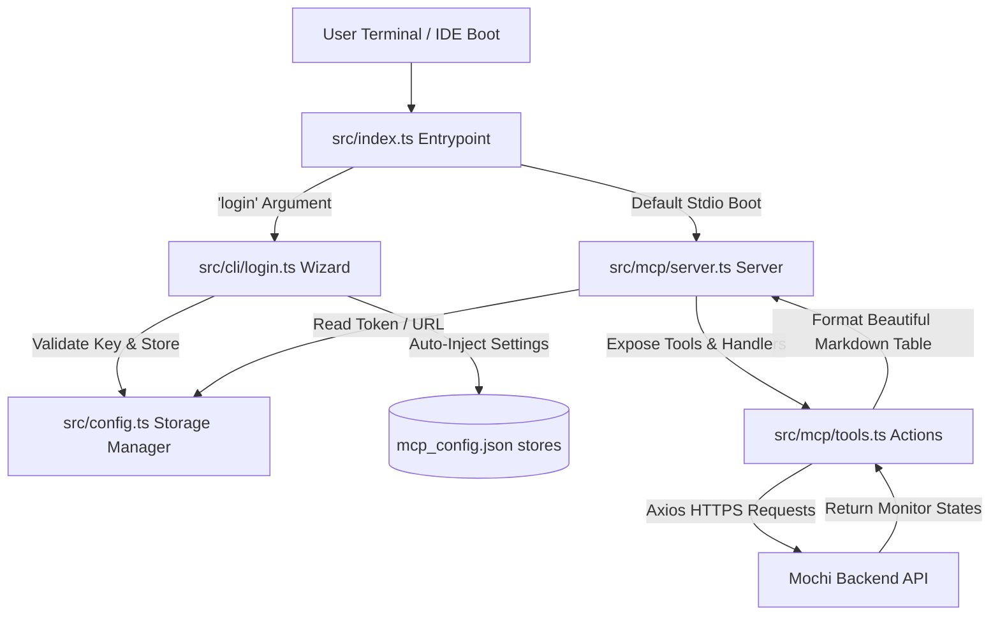

<div align="center">

### Mochi MCP


[](https://www.typescriptlang.org/)
[](https://modelcontextprotocol.io/)
[](https://www.npmjs.com/package/mochi-mcp-kit)
[](https://pnpm.io/)
[](https://github.com/)

**A premium, modular Model Context Protocol (MCP) server for the Mochi website uptime and monitoring suite.**  
*Equip your AI assistants in Cursor and Antigravity IDE with real-time website checks, intervals, active latency, and uptime reports.*

[Install](#install-it-locally) • [Run](#run-it) • [IDE Integration](#ide-integration-manual) • [Features](#-key-features) • [Tools](#-mcp-tools-exposed) • [Architecture](#-modular-architecture) • [Developer Guide](#-developer-guide)

</div>

---

## Install It Locally

```bash
bun install -g mochi-mcp-kit
```

## Run It 

```bash
mochi-mcp login
```

---

## IDE Integration (Manual)

If you prefer to configure your workspace manually, simply update your settings:

> [!IMPORTANT]
> **Cursor Configuration Open there settings/config folder**

### Configuration Snippet
Add this snippet inside the `"mcpServers"` object in either of the files:
```json
{
  "mcpServers": {
    "mochi": {
      "command": "npx",
      "args": [
        "-y",
        "mochi-mcp-kit"
      ],
      "env": {
        "MOCHI_API_KEY": "mochi_pat_xxxxxxxx", // create from mochi.elitedev.space
        "DOTENV_CONFIG_QUIET": "true", // (optional) add in antigravity 
        "DOTENVX_LOG": "error" // (optional) add in antigravity 
      }
    }
  }
}
```
---

## ⚡ Key Features

*   **🛡️ Robust TypeScript & ESM**: Built from the ground up on modern TypeScript ESM standards, compiled via `tsup` into optimized, minified production builds.
*   **🎨 Designer CLI Wizard**: A stunning setup experience powered by `@clack/prompts`, `gradient-string`, `ora` spinners, and `boxen`.
*   **🤖 Multi-IDE Auto-Configurator**: Auto-detects platform paths (Windows, macOS, Linux) and injects configurations directly into both **Cursor** and **Antigravity IDE** configuration stores.
*   **🔑 Smart Configuration Fallbacks**: Leverages `conf` secure stores while maintaining seamless fallback checks across environment variables and legacy `.mochirc` configurations.

---


## 🗺️ System Flow



---

## 🚀 Quick Start

### 1. Boot the Interactive Setup Wizard
Initialize the package configurations and link your IDEs instantly:

```bash
pnpm run dev login
```

You'll be greeted with a colorful double-bordered title box and guided step-by-step:
1.  **API Key Entry**: Paste your Mochi Access Token (format verified in real-time).
2.  **Live Token Verification**: A sleek animated spinner verifies your credentials directly against the Mochi API.
3.  **Automatic IDE Linking**: Choose whether to configure Cursor, Antigravity IDE, both, or skip.

---

## ⚙️ Configuration Hierarchy

The system resolves your credentials dynamically according to the following strict priority:

```
┌────────────────────────────────────────────────────────┐
│  1. Env Variables (MOCHI_API_KEY / MOCHI_API_URL)     │
└───────────────────────────┬────────────────────────────┘
                            ▼
┌────────────────────────────────────────────────────────┐
│  2. Secure 'conf' Store (Saved during setup)           │
└───────────────────────────┬────────────────────────────┘
                            ▼
┌────────────────────────────────────────────────────────┐
│  3. Legacy ~/.mochirc File Configs                     │
└───────────────────────────┬────────────────────────────┘
                            ▼
┌────────────────────────────────────────────────────────┐
│  4. Legacy ~/.config/mochi/config.json File Configs     │
└────────────────────────────────────────────────────────┘
```

---

## 🛠️ MCP Tools Exposed

### 🌐 `list_monitors`
Queries and lists all active and configured website monitors directly linked to your Mochi account.

#### Input Schema
*No parameters required.*

#### Live Markdown Response (LLM Rendered)

### 🌐 Mochi Active Monitors

| Monitor ID | Target URL | Cron Schedule | Current Status | Total Checks | Avg Latency | Uptime | Downtime |
| :--- | :--- | :--- | :--- | :--- | :--- | :--- | :--- |
| `d0f41ab9...` | `https://mywebsite.com` | `*/5 * * * *` | **ACTIVE** | `12,840` | `102ms` | `240.5 hrs` | `0.0 hrs` |
| `f3922c01...` | `https://api.mywebsite.com` | `*/10 * * * *` | **ACTIVE** | `6,420` | `84ms` | `120.2 hrs` | `0.1 hrs` |

---

## 📂 Modular Architecture

```
src/
├── index.ts             # Lightweight entry router (CLI login or MCP standard boot)
├── config.ts            # Configuration manager (handles Typed conf store & fallbacks)
├── cli/
│   └── login.ts         # High-fidelity setup wizard (clack prompts, ora spinner, multi-IDE setup)
└── mcp/
    ├── server.ts        # Bootstraps the MCP Server over StdioServerTransport
    └── tools.ts         # Handles tool definitions, Axios API calls, and markdown tables
```

---

## 💻 Developer Guide

### Install Dependencies
```bash
pnpm install
```

### Run Dev Live Reloading
```bash
pnpm run dev
```

### Production ESM Bundle
Bundles and minifies TypeScript using `tsup`:
```bash
pnpm run build
```

---

<div align="center">

Made with ♥ for the Mochi Ecosystem.

</div>
